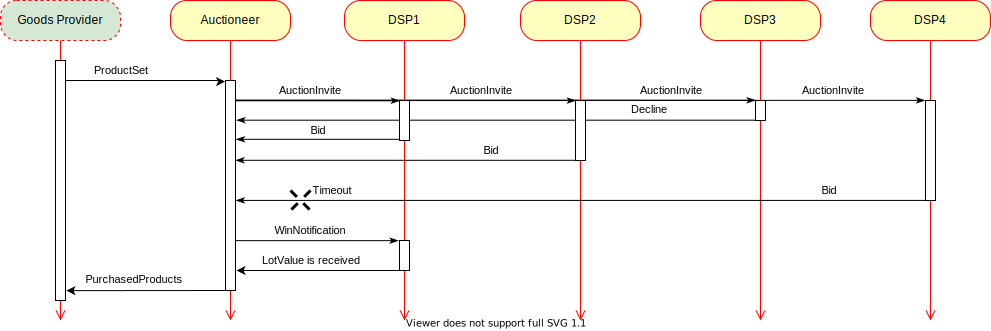
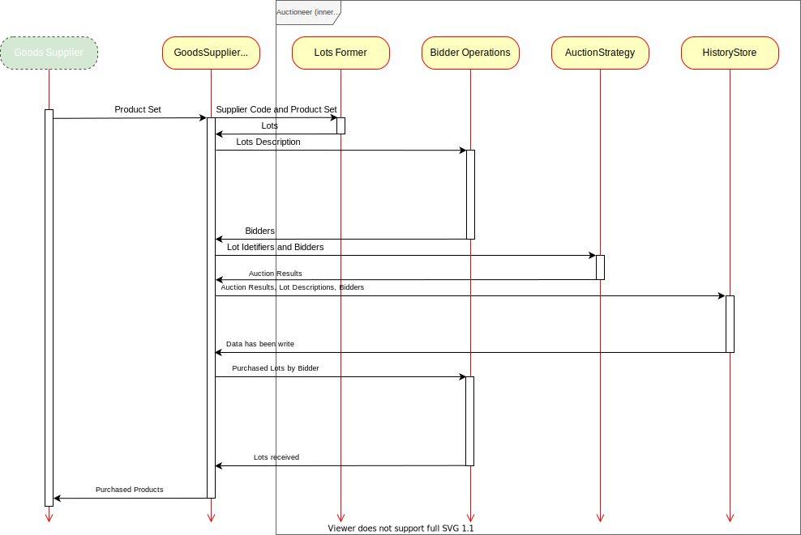

# Supply / Sell Side platform

## Introduction

Simplified system for automatic sale of various electronic goods (e.g. promotional codes, game keys) in real time bidding.

## Terminology

__SSP__: Supply / Sell Side platform. The platform automatically distributes goods to bidders by using an auction.

__DSP__: Demand Side Platform. The platform automatically buys goods via SSP. Next known as __Bidder Candidate__.

__External Goods Supplier__: External platroform that supply __Product Set__ to sold via SSP.

__Product Set__: A set of __Product__, which is sold via SSP by an abstract supplier. All products is comparable by quality in the set. __Products__ can be not unique in the set. __Product Set__ may contains __Product__ with different __Product Type__.

__Product__: An virtual product that provides value for __Bidder Candidates__ (promocode, game access key, etc). __Product__ has __Product ID__, __Product Description__ and __Product Value__. 

__Product ID__: unique identifier for each product in __Product Set__.

__Product Type__: A unique product kind within the platform. __Product Type__ is related to the __Product__ as one to many, that is, there are many __Products__ of the same __Product Type__, including from different __External Goods Suppliers__.

__Product Description__: __Product__ parameters that may interest the customer.

__Product Value__: __Product__ parameters that are of commercial value (example, promocode value).

__Product Set__: A set of __Product__, which is sold via SSP by an abstract supplier. All products is comparable by quality in the set.

__Auction__: Mechanism for distributing goods between auction members. Auction is closed and one-round.

__Lot__: The __Product__ put up for sale at an __Auction__. Once the __Product__ enters the __SSP__, it becomes a __Lot__. Each __Lot__ is unique on SSP.

__Lots__: Set of lots, which is sold at one round of auction.

__Auction Invite__: __Bidder Candidate__ invitation to auction. Its contains lots description and auction algorithm (VCG, GSP, High stakes, etc).

__Bidder Candidate__: Potential bidder who may be interested in the type of __Product__ to be sold 

__Bidder__:  __Bidder Candidate__, who accepted the invitation to participate in the auction and responded with the list of bids (one desired lot - one bid, the list of desired lots is a subset of __Lots__).

__Auction Result__: Winner and payment amount for each lot.

__Win Notification__: If the __Bidder__ wins in round of auction then it receives a notification with the lot values won and payment amounts for each lot.

__Auction History__: Statistics about auction result. Contains member's bids, winner, lots with payment amount, etc.

__Auction Strategy__: Winner selection and payment amount algorithm – VCG, GSP, etc.

## Architecture

### Components by Business Processes

External systems:

- __DSP__, buyer. Purchases the goods he is interested in at an auction via SSP

- __Goods Supplier__, merchant. Supplies goods for auction sale.

SSP Public services:

- __Auctioneer__, mediator between buyers and sellers. Depending on the selected type of auction, either maximizes the seller's profit or distributes the offered goods in a socially equitable way (e.g. VCG auctions).

- __Admin Panel__. Controls __Goods Suppliers__, __DSP__. Registers them in the system, grants accesses, restricts the types of goods sold and the way they are distributed.

- __Trading Reporter__. Provides trading reports for merchants and buyers.

### SSP Components 

Picture 1 – Architecture of SSP 

Picture 2 – Sequence diagram of SSP communication with external systems

Picture 3 – Auction algorithm Sequence diagram
